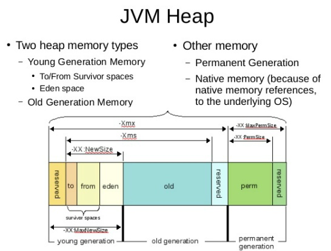

# Java

### 목차

* [프레임워크와 라이브러리의 차이점](#프레임워크와-라이브러리의-차이점)
* [JVM의 메모리 구조](#jvm의-메모리-구조)
* [가비지 콜렉터(GC)](#가비지-콜렉터)
* [리스트 정렬](#리스트-정렬)
* [버블 정렬 In Java](#버블-정렬-알고리즘)
* [삽입 정렬 In Java](#삽입-정렬-알고리즘)


---

## 프레임워크와 라이브러리의 차이점 

: 자동차와 망치라고 표현하면 편하다고 한다. 자동차는 특정 목적으로 만들어져서 목적지로 빠르게 갈 수 있는 역할만 하지만, 망치는 두드린다는 행위 하나로 사람을 때릴때도 쓸 수 있고, 못질을 할 때 쓸수있고 필요에 따라 갖다가 쓸 수 있다. 자동차를 가지고 삽질을 할 수 없고 무언가를 두들길 수도 없다. 그저 목적지까지 빠르게 데려다주는 수단일 뿐이다. 만들어질 때부터 이러한 용도로 만들어졌기 때문에 그렇다. 메뉴얼대로 조작하면 최고의 효율로 목적지까지 데려다주는게 프레임워크다. 하지만 망치는 용도에 따라 여러가지 형태로 쓰일 수 있다. 정말 잘 비유해 놓은 것 같다. 즉 프레임워크는 라이브러리와는 다르게 프로그래밍 규칙이 이미 정해져있는 것이다. 재엽님은 여기서 한 발 더 나아가서 언어를 배우는 것은 어떻게 비유할 수 있을 것인가? 에 대한 물음을 던지셨고, 스스로 사지를 움직일 수 있게 하는 것이라고 정의 내리셨다. 더 나아가서 토비의 스프링을 보면 좋은 구절이 나온다고 한다. 프레임워크는 제어의 역전이 적용된 좋은 예이다. 개발자가 짠 애플리케이션 코드가 프레임워크에 의해 사용되고, 라이브러리는 개발자가 짠 애플리케이션 코드에서 라이브러리를 사용하는 것이다. 즉 제어하는 쪽이 역전되었다고 할 수 있다.


---


## JVM의 메모리 구조
<br>

### JVM이란
- 자바가상머신은 자바로 작성된 프로그램을 실행해주는 플랫폼이다.
- 운영체제와 자바프로그램(어플리케이션) 사이에 위치하기 때문에 운영체제와 상관없이 어플리케이션을 실행하게 해주는 장점이 있다.  

### JVM의 메모리 구조
- 자바 버전에 따라 변화가 있지만, 크게 **메소드영역**, **스택영역**, **힙영역*으로 구분할 수 있다.*"  


#### 메소드 영역
- Class Area, Method Area, Static Area 라고도 불린다.
- 이름에서 알 수 있듯이 *.class 파일이 메모리에 올라가는 일과 관련되어 있다.
- 컴파일러에 의해 컴파일된 class 파일이 올라가기 때문에 메소드와 클래스 변수인 스테틱변수들이 올라간다.
- 즉, main 메소드가 있는 클래스 파일이 메모리에 저장되고 main메소드가 실행되면서 프로그램이 실행된다.
- **클래스 로딩** - 프로그램을 실행하다 메소드 호출이 있었는데 해당 메소드를 가지고 있는 클래스가 메모리 상에 없다면, 메소드 영역에 클래스를 올리게된다.  
[참고 - WANZARGEN블로그](http://wanzargen.tistory.com/16)  


#### 스택 영역
- 지역변수와 매개변수가 저장된다.
- 메소드가 호출되면 지역변수, 매개변수가 메모리에 쌓이고 메소드가 끝나면 소멸한다.
- 스택구조로 되어 있기 때문에, 1메소드안에서 2메소드가 호출되면 2메소드가 1메소드 위에 쌓이게 된다.
- 재귀호출을 잘 못 사용하게 된다면, 같은 지역변수들이 계속 쌓이게 되기 때문에 'StackOverFlow'오류가 발생하게 된다.  


### 힙 영역
- 쉽게 생각하면 new 연산자를 사용했을 때, 생성된 객체들이 저장되는 공간이다.
- `A a = new A()`라고 객체를 생성했다면 실제 객체는 힙영역에 참조변수인 a와 힙영역의 주소는 스택에 저장된다.
- **가비지 콜렉터** 더이상 힙영역의 객체가 참조되지 않는다면 힙영역에서 삭제해 주어야한다. 자바를 가비지콜렉터라는 기능으로 자동으로 실행해준다.
- 효율적인 힙관리를 위해 힙은 여러단개로 구성되어 있다.(가비지 콜렉터와 관련되어 있으므로 가비지 콜렉터에서 더 자세히 설명하도록 힌다.)  


## 가비지 콜렉터  

### 가비지 콜렉터(GC)란

> 메모리를 관리하는 로직

* 객체가 생성되면 힙영역의 메모리를 점유한다. 후에 객체의 참조가 끊기면, 이 객체는 다시 사용할 수 없기 때문에 메모리에서 제거해 주어야 한다. 이 기능을 수행하는 것이 가비지 콜렉터이다.
* GC가 작동하게 되면 실행중인 모든 쓰레드가 중지되고, GC 쓰레드만 작동하게 된다. 따라서 GC는 프로그램의 성능과 관련되기 때문에 잘 관리해 주어야 한다.


### GC의 기본 동작방식

* **추적 기반 쓰레기 수집**(대표: mark-and-sweep)
  * 모든 메모리를 확인하여 접근이 가능한 메모리에 마킹한다.
  * 마킹이 안된 곳의 제거 한다
  * 빈 공간을 압축한다
* 마킹이 끝나고 쓰레드가 작동하면 다시 마킹을 해야하기 때문에, 모든 쓰레드의 동작을 멈춘다. 이를 **stop-the-world**라 한다. 이 경우에 실시간 동작 같은경우 끊기는 현상이 발생하는 등 성능에 좋지 않다. 





### 힙 메모리

* 객체는 참조가 매우 적다. 또한 대부분의 객체는 금방 참조가 불가능한 상태가된다. 이러한 성질을 이용해서 힙 메모리를 **Young과 Old**로 구별한다.
* Young에서 살아남은 객체들을 Old로 옮기고  각 영역별로 다른 방식과 빈도수로 GC를 작동한다. 
  * Young Generation 영역 : 대체로 old 영역보다 크기가 작아 자주 GC가 발생하며 Minor GC라고 한다.
  * Old Generation 영역 : young 영역보다 크게 할당되며 GC가 적게 발생한다. Major 혹은 Full GC라고 한다.
* 좀더 구체적인 영역이 존재하지만 GC와 밀접한 관계가 있는 영역만 설명하도록 하겠다.


### Young 영역

* Young 영역은 다시 Eden과 2개의 Survivor 여역으로 나누어진다. (메모리 영역이 작기 때문에 GC가 빠르다)
* 처음 객체개 생성되면 Eden에 위치한다.
* Eden 영역에서 GC가 이루어지면 살아남은 객체는 Survivor의 빈곳으로 이동한다.
* Survivor가 가득차게 되면 여기서 살아남은 객체는 나머지 한 곳으로 옮겨지고 현재 Survivor영역은 완전히 빈상태가된다.
* 이 상황이 반복되며 계속 살아남은 객체는 Old 영역으로 옮겨진다.
* Survivor의 둘중 한곳은 항상 완전히 비어있는 상태가 되어야한다.(왜일까?)


### Old 영역

 Old 영역도 기본적으로 데이터가 가득차면 GC를 싱행하게 된다. JDK 7을 기준으로 5가지 방식이 존재한다. Old 영역은 크기가 크기 때문에 다양한 GC 방식으로 애플리케이션에 맞춰 GC 시간을 최소화 하여야 한다.

 - Serial GC
 - Parallel Gc
 - Parallel Old GC
 - Concurrent Mark & Sweep GC
 - G1(Garbage First) GC


### GC 알고리즘

#### 1. Serial Garbage Collector

 싱글 프로세스 환경에서 사용된다. 가장 일반적으로 Old 영역 전체에 Mark - Sweep - Compaction 과정을 거친다. Compaction은 GC후 메모리를 빈곳을 압축하는 과정 이다.


#### 2. Parallel Garbage Collector

 전체적인 알고리즘은 Serial GC와 같다. 차이점은 GC를 처리하는 스레드를 여러개 두는 것이다. 메모리가 충분하고 다중코어 환경에서 사용된다.


#### 3. Parallel Old Garbage Collector

 Parallel GC와 같지만, Old 영역에 대해서 Mark-Summary-Compaction 단계를 거친다. ~~Mark-summary-Compaction의 과정은 찾지 못하였다. 상대적으로 덜 중요한 것이 아닌가 싶다.~~


#### 4. CMS(Concurrent-mark-sweep) Garbage Collector

 CMS는 Mark하는 과정중 처음 사용되지 않는 객체를 찾기 되면 STW 상황에서 벗어난다. 때문에 STW가 매우 짧다 이후에 다른 쓰레드와 동시에 Mark 작업이 이루어진다. 모든 Mark작업이 끝다면 두번째 STW 이 진행되면 동시에 진행되는 과정에서 사용된 객체에 대해서 remark가 된다. 두번째 STW가 끝나면 Sweep과정 또한 동시에 진행된다. Parallel GC와 비요하여 불리한점은 쓰레드의 연속적인 작업을 위해 더 많은 cpu가 사용된다는 점이다. 때문에 어플리케이션 프리즈에 불리한 long-running server에 좋다.  

<br/>

#### 5. G1 Collector

 G1(Garbage first) Collector는 JDK7에서 소개 되었다. G1 Collector는 여러개의 백그라운드 스레드를 사용하여 힙을 스캔하여 영역을 분할한다. 그리고 쓰레기(참조할 수 없는 객체)가 많은 영역을 먼저 스캔하도록 설계되어 있다. 이러한 방법은 힙이 가득차 STW를 실행하기 전에 쓰레기를 수집하도록 해준다.


**참고 자료**  

[나무위키 - GC](https://namu.wiki/w/%EC%93%B0%EB%A0%88%EA%B8%B0%20%EC%88%98%EC%A7%91)  

[12bme블로그](https://12bme.tistory.com/57)

[naverD2-Java Garbage Collection](https://d2.naver.com/helloworld/1329)

https://blog.takipi.com/garbage-collectors-serial-vs-parallel-vs-cms-vs-the-g1-and-whats-new-in-java-8/


### JVM 메모리 구조 설명충 버전

: JVM의 메모리에는 크게 세가지 영역이 있다. 클래스 영역(보통 메소드 영역이라고 하지만 나는 클래스 영역이 더 이해하기 쉽다), 스택 영역, 힙 영역이다. 클래스 영역은 말 그대로 클래스가 로드되는 메모리이다. 클래스가 로드될 때 static으로 선언된 필드가 있다면 같이 올라간다. 그리고 클래스는 맨 처음 호출 될 때 메모리에 로드되며, 그 전에는 로드되지 않는다. 클래스가 맨 처음 호출되면 JVM은 JRE 라이브러리에서 해당 클래스를 찾고, 해당 클래스가 없으면 CLASSPATH로 설정된 곳에 방문하여 클래스를 찾는다. 찾고 난 뒤에는 바이트 코드를 비교하여 해당 클래스가 맞는지 확인하고, 메모리에 로드시켜서 JVM이 종료되기 전에는 메모리 해제가 되지 않는다. 

 스택 영역은 자료구조 스택과 기능이 똑같다. 먼저 들어간 녀석이 더 나중에 나오는 구조다. 스택 영역에는 메소드 호출 시 파라미터와 지역변수가 메모리에 자리를 잡게 된다. 그리고 메소드 호출이 끝나면 동시에 메모리가 해제된다. 메소드 내부의 루프나 if문 같은 경우에도 스택 영역에 쌓였다가 구간을 지나면 해제되는 형식인듯하다. 

 힙 영역은 GC와도 관련이 있어서 가장 까다로운 부분이다. 자바는 C와 C++처럼 포인터 개념이 없다. 따라서 new로 새로운 객체를 생성하고 변수로 그것을 참조하게 하는데, 이것을 레퍼런스라고 한다. 많은 사람들이 이것이 포인터와 똑같다고 생각하는데, 포인터는 메모리에 직접 접근할 수 있어서 Low level 개발도 가능하지만, Java의 레퍼런스는 메모리 기반이 아닌 해쉬코드 기반이다. 즉 해당 객체에 주어진 고유한 해쉬코드를 참조하는 것이다. 그러므로 Java에서는 수동으로 메모리 해제가 불가능하다. 메모리에 접근이 불가능하기 때문이다. 따라서 객체를 참조하고있던 레퍼런스가 새로운 객체를 참조하게 되면, 기존의 객체는 자신을 참조하는 레퍼런스가 없어졌으므로 메모리 상에서 갈피를 잃는다. 그렇게 되면 GC가 이 녀석을 처리하러 등장해서 메모리 해제를 자동으로 시켜준다. (추가적인 궁금증 : 객체 자신을 참조하는 레퍼런스가 없다는걸 어떻게 알 수 있을까? 라인 면접에서 질문을 봤던 것 같은데 기억이 나질 않는다. 싱글톤 객체를 생성했던 것 같은데) 

---
## 리스트 정렬

#### Comparable과 Comparator 인터페이스의 차이는 무엇일까?

> **Comparable** 인터페이스는 일반적인 순서로 정렬할 때 사용한다 (EX. 사전순서) 
>
> **Comparator** 인터페이스는 사용자가 원하는 순서로 정렬할 때 기준으로 사용한다.

배열을 정렬할 때는 Array나 Collection 클래스에 내장된 라이브러리를 사용한다. 내장된 함수 중 sort에 해당하는 메소드가 오버로딩 된 것들이 있다. 배열만 매개변수로 받거나, 배열과 Comparator 객체를 매개변수로 받는 두 가지로 분류가 된다. Comparator 객체가 없는 sort는 Comparable하게 정렬한다.

```java
1. 원시 타입
int[] numbers = {3, 2, 1};

Arrays.sort(numbers);

2. 레퍼런스 타입
String[] alphabets = {"f","c","s"};

Arrays.sort(alphabets);
```

원시타입의 배열을 정렬한다. Comparable로 자연스럽게 정렬이 된다.

그리고 레퍼런스 타입인 String은 Comparable 인터페이스를 구현하기 때문에 자동 정렬이 된다.

정렬해야 하는 타입이 Comparable 인터페이스를 구현하지 않으면 ClassCastException 예외가 발생한다.

아래가 그 예시이다.

```java
List<Man> mans = new ArrayList<>();

for(int i = 0; i < 10; i++){
    mans.add(new Man(i));
}

try {
    Arrays.sort(mans.toArray());
} catch (Exception e){
    //Maybe ClassCastException..
}
```

컴파일러는 sort의 매개변수의 타입이 Comparable 인터페이스를 구현했을 것이라고 생각한다. 그래서 여기서는 sort 메소드를 사용할 수 없다.

```java
public static <T extends Comparable<? super T>> void sort(List<T> list)  --- 메소드 시그니처
```

원하는 대로 정렬하고 싶으면 Comparator를 구현하여 sort의 매개변수로 넘겨주어야한다. 


```java
public class ReverseNumber implements Comparator<Integer> {
    @Override
    public int compare(Integer o1, Integer o2){
        return o2 - o1;
    }
}
```

역순으로 정렬이 된다. (두번째 매개변수가 첫번째 매개변수 앞에 올 때) o1-o2면 평순

이걸 실제 정렬에 사용해보자

```java
List<Integer> numbers = Arrays.asList(4,3,1,2);

Collections.sort(numbers, new ReverseNumber());			
```

**정렬 완료**


---

#### 버블 정렬 알고리즘

```java
public void bubbleSort(int[] numbers){
    boolean numbersSwitched;
    do{
        numbersSwitched = false;
        for(int i = 0; i < numbers.length - 1; i++){
            if(numbers[i+1] < numbers[i]){
                int temp = numbers[i+1];
                numbers[i+1] = numbers[i];
                numbers[i] = temp;
                numbersSwitched = true;
            }
        }
    } while (numbersSwitched);
}
```

 가장 구현하기 간단한 알고리즘이다. 하지만 최악의 경우 O(n^2)의 성능을 보여준다. 바로 역순으로 정렬되어있을 때다. 하지만 모두 다 정렬이 되어있다면 O(n)이다.


---

#### 삽입 정렬 알고리즘

```java
public List<Integer> insertSort(List<Integer> numbers){
    List<Integer> sortedList = new LinkedList<>();
    
    originalList: for(Integer number : numbers){
        for(int i = 0; i < sortedList.size(); i++){
            if(number < sortedList.get(i)){
                sortedList.add(i, number);
                continue originalList;
            }
        }
        sortedList.add(sortedList.size(), number);
    }
    return sortedList;
}
```

 삽입 정렬은 새로운 리스트를 생성하고 반환한다. LinkedList를 사용한 이유는 리스트 중간에 삽입할 일이 생기기 때문에 이런 경우, ArrayList는 배열기반이기 때문에 자리를 모두 이동시켜주는 작업들이 내부적으로 이루어져서 속도가 느리다. 

originalList를 continue 하게 되면, 아래 sortedList를 실행시키지 않는다. break와의 차이점이다. 오랜만에 이 문법을 보게 되었다. 잘 기억해두면 이렇게 유용하게 쓰일 수 있을 것 같다.

